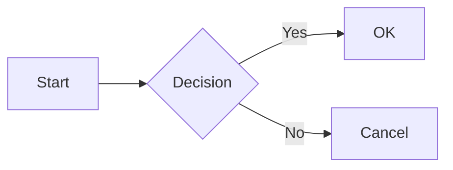
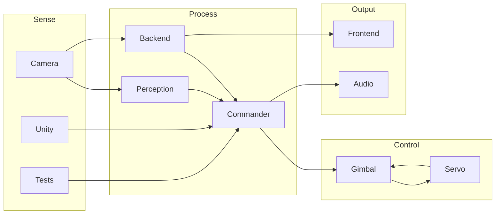
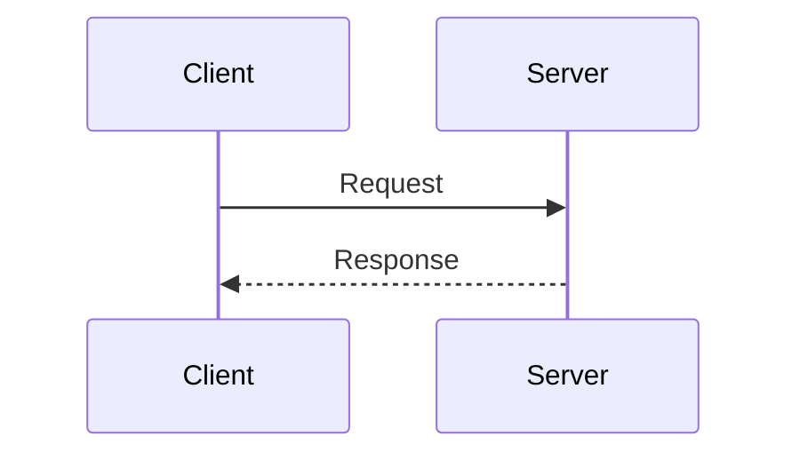

# Mermaid Complexity Detection Example

This file demonstrates how glow handles complex mermaid diagrams that exceed the ASCII renderer's capabilities.

## Simple Diagram (renders correctly)

## Complex Diagram (too complex for ASCII)

The diagram below has multiple subgraphs with cross-subgraph edges, which causes layout issues in the mermaid-ascii library (node duplication, garbled output).

## Sequence Diagram (renders correctly)

